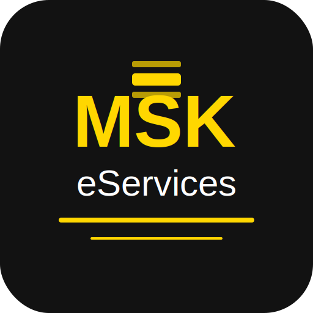

# MSK eServices - Web & Radio Hosting

A modern, responsive website for MSK eServices, offering premium web hosting and radio streaming solutions.



## Features

- **Comprehensive Hosting Plans**
  - Shared Hosting
  - Cloud Hosting
  - VPS Hosting
  - WordPress Hosting
  - Dedicated Servers
  - Radio Hosting

- **Modern UI/UX**
  - Responsive design for all devices
  - Smooth animations and transitions
  - Intuitive navigation
  - Back-to-top button for better user experience

- **Enhanced Contact Form**
  - Quick service request buttons
  - Multiple contact methods
  - Tabbed interface for different contact options

- **SEO Optimized**
  - Comprehensive meta tags
  - Structured data (JSON-LD)
  - Sitemap.xml
  - Robots.txt
  - Custom favicon set

## Technologies Used

- React.js
- React Router
- CSS3 with custom variables
- Font Awesome icons
- Responsive design principles

## Getting Started

### Prerequisites

- Node.js (v14 or higher)
- npm (v6 or higher)

### Installation

1. Clone the repository:
   ```bash
   git clone https://github.com/dhanushka-94/msk-eservices.git
   ```

2. Navigate to the project directory:
   ```bash
   cd msk-eservices
   ```

3. Install dependencies:
   ```bash
   npm install
   ```

4. Start the development server:
   ```bash
   npm start
   ```

5. Open your browser and visit:
   ```
   http://localhost:3000
   ```

## Project Structure

```
msk-eservices/
├── public/
│   ├── favicon/            # Favicon files
│   │   └── logo.svg        # MSK eServices logo
│   ├── index.html          # HTML template
│   ├── manifest.json       # Web app manifest
│   ├── robots.txt          # Robots file for SEO
│   └── sitemap.xml         # Sitemap for SEO
├── src/
│   ├── components/         # React components
│   │   ├── BackToTop.js    # Back to top button
│   │   ├── Contact.js      # Contact form
│   │   ├── Footer.js       # Footer component
│   │   ├── Header.js       # Header component
│   │   ├── Hero.js         # Hero section
│   │   ├── Pricing.js      # Pricing plans
│   │   └── Services.js     # Services section
│   ├── pages/              # Page components
│   │   ├── PrivacyPolicy.js
│   │   ├── TermsOfService.js
│   │   └── Legal.js
│   ├── App.js              # Main App component
│   ├── index.js            # Entry point
│   └── index.css           # Global styles
└── scripts/                # Utility scripts
    └── generate-favicons.js # Favicon generation script
```

## Deployment

To build the project for production:

```bash
npm run build
```

This will create a `build` directory with optimized production files.

## License

This project is licensed under the MIT License - see the LICENSE file for details.

## Contact

MSK eServices - [we-services@mskcomputers.lk](mailto:we-services@mskcomputers.lk)

Project Link: [https://github.com/dhanushka-94/msk-eservices](https://github.com/dhanushka-94/msk-eservices)
